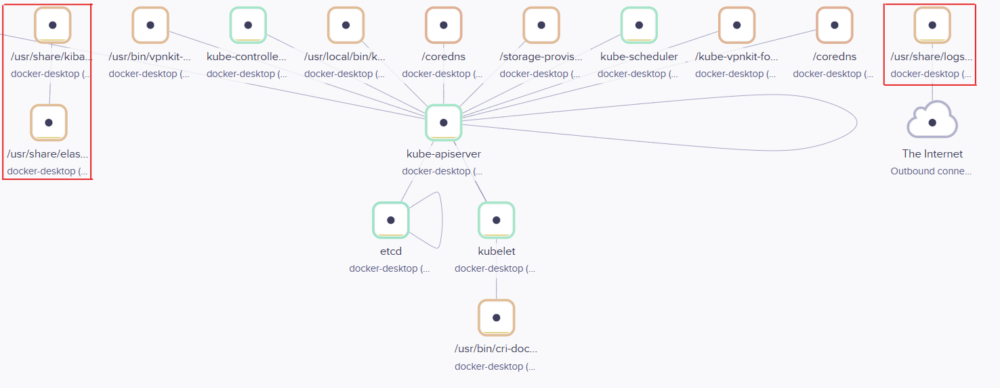
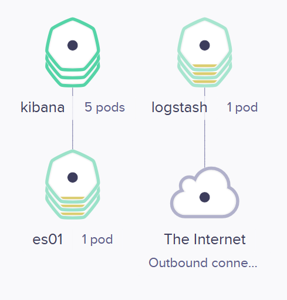
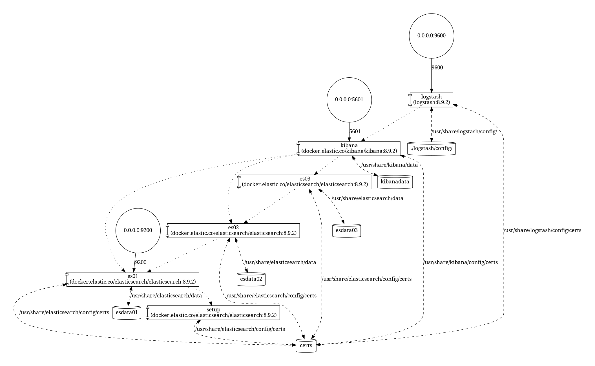

### Elasticsearch, Kibana, and Logstash Docker Compose Setup / Kubernetes
This Docker Compose / k8s configuration allows you to quickly set up and run Elasticsearch, Kibana, and Logstash with security features enabled.

https://github.com/KazuOnuki/k8s-eskibana-pylogmonitor-samplearchitect/assets/93357408/78c70b45-236b-4da6-9d19-bb2cc2c5b390
> Accessing the Kibana server deployed through Kubernetes via NodePort, this setup allows visualization of Python error logs logged in Azure Storage Blob by the `sample-pylog.py` script. After signing in with the username/password set in advance on Kubernetes, please note that in this repository, Azure blob logs are ETLed to Elastic using logstash plugins. However, you are free to customize the logstash.conf to connect to your preferred log infrastructure.

### Prerequisites
Before you begin, make sure you have Docker and Docker Compose installed on your machine.

## Case 1: k8s Architect Overview
###### k8s application process architecture 


> The application processes within the red border are Kibana, Elasticsearch, and Logstash, which we are currently creating here. Please confirm the outbound communication from Kibana to Elasticsearch, and note that Logstash does not have communication dependencies with any other process. 

###### k8s service architecture


> it's creating components for Kibana, Elasticsearch, and Logstash as services. While allowing outbound communication from Kibana to Elasticsearch, Logstash performs outbound access to the internet.

## Case 2: Docker Compose Architect Overview



> pls check [How to read the graph](https://github.com/pmsipilot/docker-compose-viz#how-to-read-the-graph) of my favorite repository `pmsipilot/docker-compose-viz` about each diagrams.

-----
#### Case 1 (k8s Architecture) Usage
```bash
# you create python log
## check repo: https://github.com/KazuOnuki/pylogger2azblob
## NOTE: if you'd like to use other log infra, please execute it and accordingly customize k8s/config/logstash.conf 
python ./sample-pylog.py

# navigate to k8s dir
cd k8s

# Step 1: Delete the Kubernetes namespace "eskibana"
kubectl delete ns eskibana

# Step 2: Start Docker Compose
docker-compose up
```

```yaml
# Step 3:  create k8s/config/logstash.conf like below
input {
  azure_blob_storage
  {
      storageaccount => "<your storage account>"
      access_key => "<your access key>"
      container => "<your container log>"
  }
}
# as you like, you customeze grok pattern👍
filter {
  grok {
      match => { "message" => "%{LOGLEVEL:loglevel} %{USERNAME:username} %{TIMESTAMP_ISO8601:timestamp} %{GREEDYDATA:message}" }
    }
}
output {
  elasticsearch {
    hosts => ["https://<your-elasticsearch-container-name>:9200/"]
    index => "<your-any-index>"
    cacert => "/usr/share/logstash/config/certs/ca/ca.crt"
    # User with Elasticsearch role to control the Elasticsearch index
    user => " <your-elastic-search-username> eg. logstash_internal"
    # User's password
    password => "<your-elastic-search-password eg. logstash_internal>" 
  }
  stdout {}
}
```

```bash
# Step 4: Export configuration data(config/**) to "./manifest/01-configMap.yaml"
# export config/ data to ./manifest/01-configMap.yaml manifest
4. kubectl create configmap es-certs-configmap --from-file=config/certs/ca.zip --from-file=config/certs/certs.zip --from-file=config/certs/instances.yml --from-file=config/certs/es01/es01.crt --from-file=config/certs/es01/es01.key --from-file=config/certs/ca/ca.crt --from-file=config/certs/ca/ca.key --from-file=config/kibana.yml --from-file=config/logstash.conf --from-file=config/logstash.yml --dry-run=client -o yaml > ./manifest/01-configMap.yaml

# Step 5: Create the Kubernetes namespace "eskibana"
5. kubectl create ns eskibana

# Step 6: Apply manifests within "./manifest" to the "eskibana" namespace
6. kubectl apply -f ./manifest -n eskibana

# Step 7: access to localhost:<k8s kibana server nodeport>
7. kubectl get svc kibana -n eskibana --output=jsonpath='{.spec.ports[?(@.port==5601)].nodePort}'| xargs -I {} sh -c 'python ./sample-pylog.py && start http://localhost:{}'
```

--------

#### Case 2 (Docker Compose Architecture) Usage
```bash

# navigate to k8s dir
cd single-node-multicontainer

# Step 1: edit ./.env for your preferrence

# Step 2: Start Docker Compose
docker-compose up

#  This command will start Elasticsearch, Kibana, and Logstash containers.
docker-compose ps
```

Open your browser and go to `http://localhost:5601` to access Kibana.
Log in with the following credentials:
```env
Username: <your-elastic-search-username eg. elastic>
Password: <your-elastic-search-pass eg. elastic>
```

🎊🎊 **Finally we start sending logs to Logstash and explore your data in Kibana!!** 🎊🎊

>Additional Information
Elasticsearch is accessible at https://localhost:9200.
Logstash is used for data-exporting internally.
Feel free to customize the Docker Compose file and configurations based on your specific requirements.
